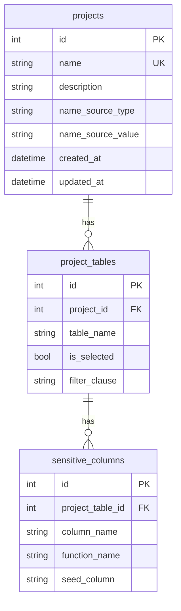

# 資料庫架構文件：config.db

**所屬系統**：DEV_DB_Cloner / 專案組態管理

**說明**：使用 SQLite 儲存專案設定，包含專案基本資訊、資料表選取/篩選設定、以及 PII 去敏化欄位規則。由 `config_manager.py` 中的 SQLAlchemy ORM 模型定義與管理。

---

# 資料表：projects

**所屬系統**：專案管理 (Project Selector)

**說明**：儲存專案基本資訊與姓名來源設定，每個專案可對應多組資料表設定。

## 欄位定義

| 序號 | 欄位名稱 | 中文說明 | 資料型別 | 允許空值 | 主鍵 | 備註 |
|------|----------|----------|----------|----------|------|------|
| 1 | id | 專案編號 | Integer | 否 | PK | 自動遞增 |
| 2 | name | 專案名稱 | String | 否 | | UNIQUE，不可重複 |
| 3 | description | 專案說明 | String | 是 | | |
| 4 | name_source_type | 姓名來源類型 | String | 否 | | 預設 `DEFAULT`，可為 `DB` 或 `FILE` |
| 5 | name_source_value | 姓名來源值 | String | 是 | | 當 type=DB 時為 `Table.Column`；type=FILE 時為檔案路徑 |
| 6 | created_at | 建立時間 | DateTime | 否 | | 預設 `datetime.now` |
| 7 | updated_at | 更新時間 | DateTime | 否 | | 異動時自動更新 |

## 欄位說明

- **id** （主鍵）：專案編號，型別為 Integer，自動遞增，不可為空
- **name**：專案名稱，型別為 String，不可為空，具 UNIQUE 限制
- **description**：專案說明，型別為 String，可為空
- **name_source_type**：姓名來源類型，型別為 String，預設 `DEFAULT`，可選 `DB`（資料庫表欄位）或 `FILE`（外部檔案）
- **name_source_value**：姓名來源值，型別為 String，可為空。type=DB 時格式為 `Table.Column`；type=FILE 時為檔案路徑
- **created_at**：建立時間，型別為 DateTime，自動產生
- **updated_at**：更新時間，型別為 DateTime，每次更新自動刷新

---

# 資料表：project_tables

**所屬系統**：專案資料表設定

**說明**：儲存各專案下的資料表選取狀態與篩選條件 (WHERE clause)。每個專案可對應多筆資料表設定。

## 欄位定義

| 序號 | 欄位名稱 | 中文說明 | 資料型別 | 允許空值 | 主鍵 | 備註 |
|------|----------|----------|----------|----------|------|------|
| 1 | id | 設定編號 | Integer | 否 | PK | 自動遞增 |
| 2 | project_id | 所屬專案編號 | Integer | 否 | | FK → `projects.id` |
| 3 | table_name | 資料表名稱 | String | 否 | | |
| 4 | is_selected | 是否已選取 | Boolean | 否 | | 預設 `False` |
| 5 | filter_clause | 篩選條件 | String | 是 | | SQL WHERE 子句 |

## 欄位說明

- **id** （主鍵）：設定編號，型別為 Integer，自動遞增，不可為空
- **project_id**：所屬專案編號，型別為 Integer，不可為空，外鍵參考 `projects.id`
- **table_name**：資料表名稱，型別為 String，不可為空。與 `project_id` 組成 UNIQUE 限制 (`uq_project_table`)
- **is_selected**：是否已選取，型別為 Boolean，預設 `False`，表示使用者是否勾選此表進行複製
- **filter_clause**：篩選條件，型別為 String，可為空。儲存 SQL WHERE 子句，例如 `data_year > '114' AND mm > '3'`

---

# 資料表：sensitive_columns

**所屬系統**：PII 去敏化規則設定

**說明**：儲存各資料表中需要去敏化處理的欄位及其對應的處理函數。每個 project_table 可對應多筆敏感欄位規則。

## 欄位定義

| 序號 | 欄位名稱 | 中文說明 | 資料型別 | 允許空值 | 主鍵 | 備註 |
|------|----------|----------|----------|----------|------|------|
| 1 | id | 規則編號 | Integer | 否 | PK | 自動遞增 |
| 2 | project_table_id | 所屬資料表設定編號 | Integer | 否 | | FK → `project_tables.id` |
| 3 | column_name | 欄位名稱 | String | 否 | | |
| 4 | function_name | 去敏化函數名稱 | String | 否 | | 例如 `obfuscate_name` |
| 5 | seed_column | 種子欄位 | String | 是 | | 用於產生可重複的去敏結果 |

## 欄位說明

- **id** （主鍵）：規則編號，型別為 Integer，自動遞增，不可為空
- **project_table_id**：所屬資料表設定編號，型別為 Integer，不可為空，外鍵參考 `project_tables.id`
- **column_name**：欄位名稱，型別為 String，不可為空。與 `project_table_id` 組成 UNIQUE 限制 (`uq_table_column`)
- **function_name**：去敏化函數名稱，型別為 String，不可為空。可用函數：`obfuscate_name`、`anonymize_id`、`obfuscate_address`、`obfuscate_phone`、`clear_content`
- **seed_column**：種子欄位，型別為 String，可為空。指定時會將該欄位值加鹽 (salt) 作為去敏化種子，以確保同一來源值產生可重複的去敏結果

---

## 資料表關聯

